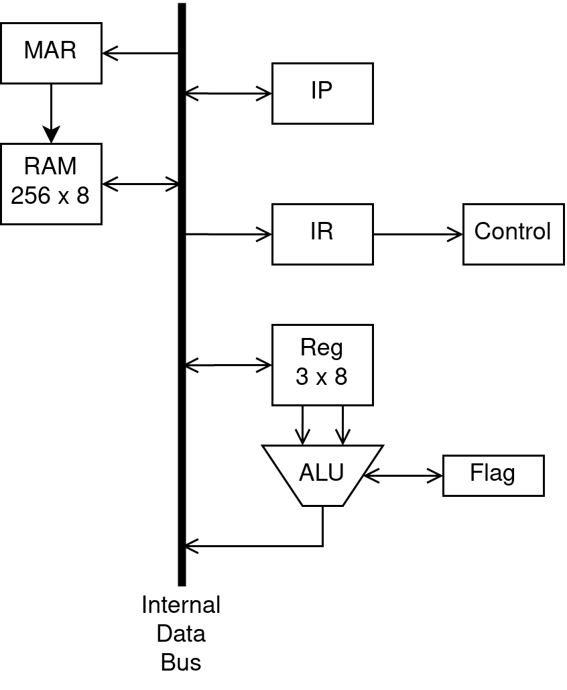
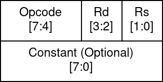
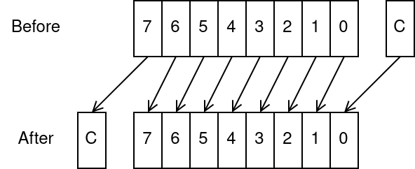
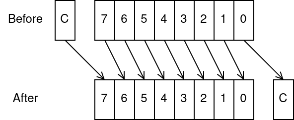

# Simple 8 bit CPU in Verilog

**Design Goal**

- Simple as possible

**Spec**

- 8 bit data bus
- 8 bit ALU with following function
  - add, subtract
  - and, or, xor
  - rotate left, rotate right
- 3 scratch register
- 8 bit instruction
- 0, 1 or 2 operand instruction
- 1 or 2 word instruction.
- Hardwire Control Unit

**Diagram**

**Explanation**

1. Fetch instruction from RAM by
   1. Load MAR with instruction address in IP
   2. Load IR with content from RAM
   3. Increment IP
2. Decode instruction in IR
3. Execute instruction
4. Repeat step above until hit HALT instruction

# Instructions

## Encoding

## Operations

**Data**

| instruction | opcode | rd  | rs  | const | operation      |
| ----------- | ------ | --- | --- | ----- | -------------- |
| NOP         | 0000   | 00  | 00  | -     | (do nothing)   |
| LD const    | 0010   | rd  | 00  | const | rd = const     |
| LD direct   | 0000   | rd  | 00  | addr  | rd = mem\[addr] |
| ST direct   | 0001   | 00  | rs  | addr  | mem\[addr] = rs |
| LD indirect | 0000   | rd  | rs  | -     | rd = mem\[rs]   |
| ST indirect | 0001   | rd  | rs  | -     | mem\[rd] = rs   |
| TRANSFER    | 0010   | rd  | rs  | -     | rd = rs        |

**Arithmetic**

| instruction | opcode | rd  | rs  | operation        | flag       |
| ----------- | ------ | --- | --- | ---------------- | ---------- |
| SC          | 1110   | 00  | 00  | c = 1            | c          |
| CC          | 1101   | 00  | 00  | c = 0            | c          |
| ADC         | 0101   | rd  | rs  | rd = rd + rs + c | z, c, n, v |
| SBC         | 0110   | rd  | rs  | rd = rd - rs - c | z, c, n, v |
| CMP         | 0100   | rd  | rs  | rd - rs - c      | z, c, n, v |

**Bitwise**

| instruction | opcode | rd  | rs  | operation         | flag |
| ----------- | ------ | --- | --- | ----------------- | ---- |
| AND         | 1000   | rd  | rs  | rd = rd & rs      | z    |
| OR          | 1001   | rd  | rs  | rd = rd \| rs     | z    |
| XOR         | 1010   | rd  | rs  | rd = rd ^ rs      | z    |
| RL          | 1100   | dd  | 00  | _see image below_ | z, c |
| RR          | 1101   | dd  | 00  | _see image below_ | z, c |

_Rotate Left_

_Rotate Right_

**Control flow**

| instruction | opcode | rd  | rs  | constant | operation             |
| ----------- | ------ | --- | --- | -------- | --------------------- |
| J           | 0100   | 00  | 00  | addr     | jump always           |
| JC          | 1100   | 00  | 00  | addr     | jump to addr if c = 1 |
| JV          | 0101   | 00  | 00  | addr     | jump to addr if v = 1 |
| JN          | 0110   | 00  | 00  | addr     | jump to addr if n = 1 |
| JZ          | 1000   | 00  | 00  | addr     | jump to addr if z = 1 |
| HALT        | 1111   | 00  | 00  | -        | stop execution        |

# Acknowledgment

All the constrains are based on Basys 3 Artix-7 FPGA Board, which you might have to adjust it if you use other FPGA board.

This project is a part of CPE223 Digital Electronics and Logic Design. Department of Computer Engineering, King Mongkut's University of Technology Thonburi.